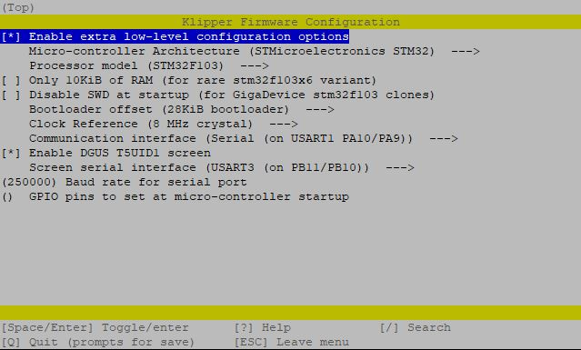

# klipper
klipper v0.12.0 + desuuuu DWIN T5UID1 touchscreen (i use it on Ender 6)

You need modify FW in display:
https://github.com/Teapack89/DGUS-reloaded-Klipper

This procedure below is for the Ender 6!

Add to printer.cfg:
```
[t5uid1]
firmware: dgus_reloaded
machine_name: Ender 6
volume: 0
brightness: 100
z_min: 0
z_max: 400
```

Compile FW:
```
cd ~/klipper
make menuconfig
make
```
[]

Then rename klipper.bin to something else (like klipper08012025.bin and put on card formated FAT32 4096bytes). Put card to printer, power-on, wait 1min and turn off.


---------------------------------------------------------------
From:
https://github.com/Klipper3d/klipper

with update from:
https://github.com/Desuuuu/klipper

Using this script (found in Desuuuu->Issues - user xdadrm):
```
#!/bin/bash
if [ ! -d klipper/.git ]; then
  git clone https://github.com/Klipper3d/klipper.git klipper
else
  echo "Klipper exists .."
fi

pushd klipper 


if ( git branch | grep desuuuu-ender6 -q ); then
  git switch desuuuu-ender6
else
  git branch desuuuu-ender6  
  git checkout desuuuu-ender6
fi

GIT_EDITOR=/bin/true git pull https://github.com/Klipper3d/klipper.git
GIT_EDITOR=/bin/true git pull -q -X ours --no-rebase https://github.com/Desuuuu/klipper.git

popd
```
